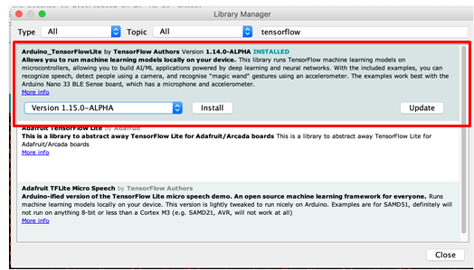
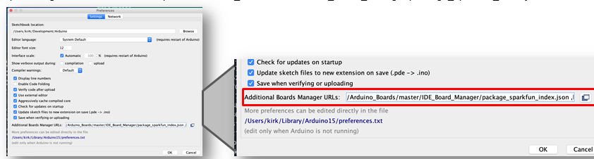
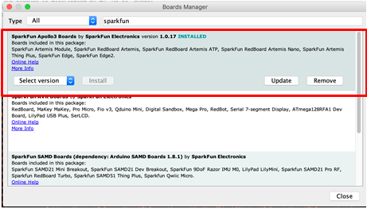

SparkFun Low-Power Machine Learning Examples
============================================

<p align="center" valign="middle">
     
      
</p>

 

This repository contains examples that demonstrate the use of [TensorFlow Lite](https://www.tensorflow.org/lite/) based machine learning executing on the [SparkFun Edge Development](https://www.sparkfun.com/products/15170) board. The examples are designed for use within the Arduino development environment, enabling rapid setup and deployment of the examples.

The examples contained in this repository make use of the variety of sensors available on the SparkFun Edge Development board to show the modern capabilities of machine learning executing on a low-power microcontroller-based system.

The following examples are included in the repository:
* micro_speech - Using the on-board microphone to detect a spoken keyword
* person_detection - Using an attached camera to detect the presence of a person in an image. 
* magic_wand - Using the on-board accelerometer to detect gestures (movement of the breakout board) 

## Contents

* [Required Hardware ](#required-hardware)
* [Software Setup](#software-setup)

Required Hardware
-----------------

To run the examples, the following hardware is required:
* [SparkFun Edge Development breakout board](https://www.sparkfun.com/products/15170)
* [Himax CMOS Imaging Camera – HM01B0](https://www.sparkfun.com/products/15570)
* [SparkFun Serial Basic Breakout](https://www.sparkfun.com/products/14050) or [SparkFun Serial Basic Breakout USB-C](https://www.sparkfun.com/products/15096)
* [USB-A to micro-B cable](https://www.sparkfun.com/products/10215) or a cable to connect the Serial Basic to the development computer.

<p align="center" valign="middle">
     
      
   
     
</p>

Software Setup
--------------
The examples in this repository are for use and execution within the Arduino development environment. This section details the steps required to setup Arduino for the examples.

### Install Arduino


Arduino is avilable for a variety of platforms. To ensure compatiblity with the demos in this repository, the latest version should be installed.

The Arduino application is available for a variety of platforms and is available online from Arduino. Download the application from the Arduino website using this [link](https://www.arduino.cc/en/Main/Software).

### Install the TensorFlowLite Library

The examples utilize the TensorFlowLight Arduino libary, which is installed using the Arduino Library Manager. 

To install this library, use the following steps:

* In Arduino, select the "Manage Libraries..." menu item. ***Tools > Manage Libraries...***
* In the Library Manager interface, search for tensorflow
* Select the library **Arduino_TensorFlowLite** by **TensorFlow Authors**
* Select the *non-precompiled* version of the libary
* Select the **Install** button to install the library

### Install the Himax HM01B0 Camera Library

With the Library Manager dialog still displayed, install the Himax camera driver.
* Search for ***himax***
* Select the **SparkFun Himax HM01B0 Camera"** Library and then select the **Install** button.  

Once the install is completed, close the Arduino *Library Manager* dialog.

### Install the SparkFun Boards Package

Load the SparkFun Boards package into the Arduino Board Manger.

To install package, use the following steps:

* In Arduino, open the Preferences menu item. ***File > Preferences***, (macOS) ***Arduino > Preferences***
* Add the following path to the ***Additional Boards Manager URLs:*** path in preferences.

  ```https://raw.githubusercontent.com/sparkfun/Arduino_Boards/master/IDE_Board_Manager/package_sparkfun_index.json```

* Select the ***OK*** button to save the preferences.



#### Install the SparkFun Artemis Boards Package 

Once the location of the SparkFun boards package is set in the preferences, the board definition package for the SparkFun Apollo3 boards must be installed. 

To install package, use the following steps:

* In Arduino, open the Preferences menu item. ***Tools > Board "..." > Manage Boards...***
* Search for *SparkFun*
* Select the **SparkFun Apollo3 Boards" package 
* Close the dialog
* Select the SparkFun Edge Board. ***Tools > Boards "..." > SparkFun Edge***
* Set the Bootloader to the ***SparkFun Variable Loader***. ***Tools > Bootloader "..." > SparkFun Variable Loader..."


Getting Started
----------------

### Hardware
* Plug USB cable into computer
* Connect CH340C adapter to USB cable
* Plug in Edge board to adpater

### Software
* Install [Arduino](https://www.arduino.cc/en/Main/Software)
* Install SparkFun Apollo3 Arduino Core
  * Add the SparkFun boards ```.json``` file to Arduino board manager URLs
    * Open Arduino preferences (File->Preferences)
    * Copy ```https://raw.githubusercontent.com/sparkfun/Arduino_Boards/master/IDE_Board_Manager/package_sparkfun_index.json```
    * Paste in the ```Additional Boards Manager URLs:``` field
  * Install via Arduino Boards Manager  
    * Open the Boards Manager (Tools->Board->Boards Manager)
    * Search for ```apollo3```
    * Click ```install```
* Install library dependencies
  * Open the Arduino Library Manager (Sketch->Inlude Library->Manage Libraries)
  * ```Arduino_TensorFlowLite``` Arduino library
    * Search for ```Arduino_TensorFlowLite```
    * Install the top result using the version ```Version 1.15.0-ALPHA``` (**not** the *precompiled* option)
  * ```SparkFun Himax HM01B0 Camera``` library
    * Search for ```SparkFun Himax HM01B0 Camera```
    * Install ```v0.0.1```
* Download (or clone) this repo to favorite location
* Open Arduino
* Open an example from this repo through Arduino by clicking on a ```.ino``` file in one of the example directories
  * ```micro_speech```
* Select the ```SparkFun Edge``` board (Tools->Board under 'SparkFun Apollo3')
* Select the proper port to connect with the baord (Tools->Port)
* Change the **Bootloader** from *Ambiq Secure Bootloader (Default)* to *SparkFun Variable Loader (Enable w/ Artemis Bootloader)* (Tools->Bootloader)
  * (Your boards have received the upgraded bootloader already)
* Change the ```SVL Baud Rate``` from *921600* to *460800*

### Upload
* Compile with the ```Verify``` button (checkmark symbol)
* Upload with the ```Upload``` button (arrow symbol)
  * If uploading fails try lowring the bootloader baud rate

### Serial Monitor
* Open the Serial Monitor by clicking on the magnifying glass icon (top right) or (Tools->Serial Monitor)
